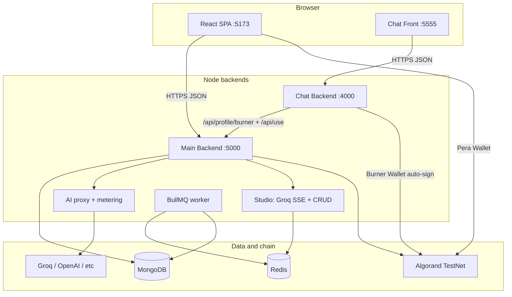

# SentinelAI

**Pay-per-use AI API marketplace on Algorand** — creators publish AI services, users pay in ALGO micro-transactions per call, and every payment settles directly peer-to-peer on the Algorand TestNet blockchain. No subscriptions, no lock-in.

---

## Team Sentinels

| Name            |
|-----------------|
| Aarya Pawar     |
| Manas Shete     |
| Debjit Debnath  |
| Aayush Lathi    |

---

## Table of Contents

1. [What this repository contains](#1-what-this-repository-contains)
2. [Business Model](#2-business-model)
3. [Repository structure](#3-repository-structure)
4. [Architecture](#4-architecture)
5. [Prerequisites](#5-prerequisites)
6. [Setup guide](#6-setup-guide)
7. [Environment variables](#7-environment-variables)
8. [Smart contract](#8-smart-contract)
9. [API surface (summary)](#9-api-surface-summary)
10. [Frontend routes](#10-frontend-routes)
11. [x402 Payment Protocol](#11-x402-payment-protocol)
12. [Agent Context JSON](#12-agent-context-json)
13. [Production notes](#13-production-notes)
14. [Git workflow and commits](#14-git-workflow-and-commits)
15. [Further reading](#15-further-reading)

---

## 1. What this repository contains

| Area | Purpose |
|------|---------|
| **`frontend/`** | Vite + React 18 + Tailwind. **Marketplace** (`/dashboard/*`) for API discovery, keys, usage, billing. **Studio** (`/studio/*`) for blogging, projects, platforms, analytics (Groq-backed). |
| **`backend/`** | Express API, MongoDB (Mongoose), JWT auth, Algorand helpers, AI proxy for marketplace services, **Studio** routes (`/api/studio`), BullMQ publishing worker. |
| **`contract/`** | Puya / **algopy** smart contract (`SentinelContract`) + deploy script + compiled `artifacts/`. |
| **`chatbot/`** | Standalone AI chatbot powered by the Sentinel marketplace — `chat-backend` (Express, port 4000) orchestrates burner wallet payments automatically; `chat-front` (Vite + React, port 5555) is the user-facing chat UI. |

**Ecosystem split (product):**

- **Marketplace** — Browse, buy, and use AI APIs published by creators. All calls are pay-per-use in ALGO.
- **Studio** — Content workflows: Groq-only blog generation (SSE), drafts, scheduling, BullMQ publishing (Redis), encrypted platform tokens.
- **Chatbot** — A first-party consumer of the Sentinel marketplace. Uses the burner wallet to pay for AI calls automatically, demonstrating the full pay-per-use flow without manual wallet interaction per message.

---

## 2. Business Model

Sentinel operates as a **decentralized AI API marketplace**. There are three types of participants:

### Creators (Supply side)
- Register as a Creator and publish AI services wrapping models from **Groq, OpenAI, Anthropic, or Together AI**.
- Set their own pricing: **ALGO per 1,000 tokens** + a **minimum charge per call**.
- Their provider API key is stored **AES-256-GCM encrypted** in the database and never exposed.
- Every time a user calls their service, the ALGO payment goes **directly from user wallet → creator wallet** — peer-to-peer, no platform cut held in escrow.

### Users (Demand side)
- Browse the marketplace and call any AI service.
- Pay **per call** in ALGO via Algorand TestNet. No monthly subscription.
- Generate an API key per service and use it like any other API (`Authorization: Bearer sk-sentinel-xxx`).
- The **Burner Wallet** feature lets users fund a small hot wallet that pays automatically, removing the need to sign each transaction manually.

### Platform (Sentinel)
- Charges no direct cut on marketplace transactions (all ALGO goes creator → user directly).
- Monetizes via **Studio subscriptions**: Creator ($5/mo), Pro ($15/mo), Enterprise ($40/mo) — paid in ALGO to `RECEIVER_WALLET`.
- Earns the **minimum network fee** on proof-of-intelligence transactions (0.001 ALGO per call) as immutable on-chain logs.
- The optional **SentinelContract** smart contract tracks aggregate platform volume on-chain.

### Key Revenue Streams

| Stream | Mechanism |
|--------|-----------|
| Studio subscriptions | Creators pay ALGO/month for content workflow features |
| Creator listings | Creators fund their own AI provider keys — platform is zero-custody |
| Proof-of-intelligence logs | 0.001 ALGO platform fee per successful AI call (on-chain attestation) |
| Future: x402 endpoint fees | Per-request micro-fees from AI agents calling the marketplace programmatically |

---

## 3. Repository structure

```
pay-per-usage-ai-api-access-system-using-algorand/
├── README.md                 ← This file
├── DOCUMENTATION.md          ← Deep-dive: flows, full endpoint tables, glossary
├── backend/
│   ├── package.json
│   └── src/
│       ├── server.js         ← Express entry, routes, static SPA in production
│       ├── config/           ← db, firebase admin, contract config
│       ├── middleware/       ← auth, rate limits, studio quota
│       ├── models/           ← User, Service, Transaction, Studio models, …
│       ├── routes/           ← auth, services, use, payment, profile, studio, …
│       ├── controllers/      ← studio.controller.js
│       ├── services/         ← aiProxy, billing, blog.service, algorand, …
│       ├── providers/        ← groqProvider.js (Studio AI)
│       ├── queues/           ← BullMQ publishing queue
│       ├── workers/          ← publishingWorker.js
│       └── utils/            ← encrypt, jwt helpers, …
├── frontend/
│   ├── package.json
│   ├── vite.config.js        ← dev server + /api → localhost:5000
│   └── src/
│       ├── main.jsx          ← QueryClientProvider, Router, Auth
│       ├── App.jsx           ← Nested /dashboard, /studio, /billing, redirects
│       ├── layouts/          ← MarketplaceLayout, StudioLayout
│       ├── pages/            ← marketplace + studio/* pages
│       ├── components/       ← sidebars, wallet, profile, …
│       ├── context/          ← AuthContext
│       ├── wallet/           ← pera.js (Pera Wallet), burner.js (Burner Wallet)
│       └── api/client.js     ← axios + JWT
├── contract/
│   ├── sentinel_contract.py  ← ARC4 contract source
│   ├── deploy.py
│   ├── requirements.txt
│   ├── artifacts/            ← TEAL + ARC56 JSON (generated)
│   └── contract_info.json    ← written by deploy (app id + address)
└── chatbot/
    ├── chat-backend/         ← Express server (port 4000) — orchestrates burner payments
    │   ├── server.js
    │   ├── routes.js         ← /conversations, /user-info, /chat, /messages
    │   ├── models.js         ← Conversation, Message schemas
    │   ├── middleware.js      ← JWT auth (shared secret with main backend)
    │   └── .env
    └── chat-front/           ← Vite + React chat UI (port 5555)
        └── src/
            ├── App.jsx
            └── components/   ← ChatWindow, Sidebar, MessageBubble
```

---

## 4. Architecture

High-level data flow:



**Marketplace call (simplified):** user requests a quote on `/api/use` → backend runs AI and returns `paymentRef + chargeAlgo` → user pays on-chain → user claims response with `txId + paymentRef`.

**Chatbot flow:** user sends a message on chat-front → chat-backend fetches burner mnemonic from main backend → builds Algorand transaction → pays the official Sentinel AI service automatically → returns the AI response.

**Studio:** blog generation streams from Groq through `/api/studio/blog/generate` (SSE). Publishing is **never inline**: `POST /api/studio/blog/schedule` enqueues BullMQ jobs; `publishingWorker` updates `BlogPost` status.

---

## 5. Prerequisites

| Tool | Version / notes |
|------|-----------------|
| **Node.js** | ≥ 20 (`backend` and `frontend` engines) |
| **MongoDB** | Atlas or local URI for Mongoose |
| **Redis** | Required for Studio publishing queue (BullMQ). Worker start is wrapped in try/catch if Redis is down. |
| **Python** | 3.10+ for `contract/` (puyapy, algopy, py-algorand-sdk) |
| **Algorand** | TestNet account with ALGO for deploy and demos (Pera or similar) |

---

## 6. Setup guide

### 6.1 Clone and install

```bash
git clone <your-fork-or-origin-url>
cd pay-per-usage-ai-api-access-system-using-algorand
```

**Backend** (main API, port 5000)

```bash
cd backend
npm install
# create backend/.env — see §7
npm run dev
# health: GET http://localhost:5000/api/health
```

**Frontend** (main marketplace, port 5173)

```bash
cd frontend
npm install
npm run dev
# proxies /api → http://localhost:5000 via vite.config.js
```

**Chat Backend** (chatbot server, port 4000)

```bash
cd chatbot/chat-backend
npm install
# create chatbot/chat-backend/.env — must share JWT_SECRET and ENCRYPTION_KEY with main backend
npm run dev
# health: GET http://localhost:4000/health
```

**Chat Frontend** (chat UI, port 5555)

```bash
cd chatbot/chat-front
npm install
npm run dev
```

**Smart contract (optional)**

```bash
cd contract
python -m venv .venv
# Windows: .venv\Scripts\activate  |  macOS/Linux: source .venv/bin/activate
pip install -r requirements.txt
# set DEPLOYER_MNEMONIC in env, then:
python deploy.py
# writes contract/contract_info.json
```

### 6.2 Verify

1. `http://localhost:5173` — main marketplace with login
2. `http://localhost:5555` — chatbot UI (requires login)
3. `curl http://localhost:5000/api/health` → `{"ok":true}`
4. `curl http://localhost:5000/api/services/agent-context` → live service catalog JSON

---

## 7. Environment variables

### 7.1 Core backend (`backend/.env`)

| Variable | Purpose |
|----------|---------|
| `PORT` | API port (default `5000`) |
| `MONGODB_URI` / `MONGO_URI` | MongoDB connection string |
| `JWT_SECRET` | Signs session JWTs — **must match chat-backend** |
| `ENCRYPTION_KEY` | AES-GCM for secrets at rest — **must match chat-backend** |
| `NODE_ENV` | `production` serves `frontend/dist` from Express |
| `FRONTEND_ORIGIN` / `FRONTEND_URL` | CORS allowlist |

### 7.2 Algorand (optional but used in flows)

| Variable | Purpose |
|----------|---------|
| `ALGOD_SERVER` / `ALGORAND_NODE` | Algod URL (defaults to public testnet) |
| `ALGOD_TOKEN` | If using a private node |
| `ALGO_INDEXER_URL` | Indexer URL (default: testnet algonode) |
| `ALGO_APP_ID` / `ALGO_CONTRACT_ADDRESS` | Override on-chain app |
| `PLATFORM_MNEMONIC` | Proof-of-intelligence signing wallet |
| `PROOF_LOG_ADDRESS` | Algorand address that receives proof logs |

### 7.3 Firebase (Google auth)

Configure Firebase Admin (`GOOGLE_APPLICATION_CREDENTIALS` or service account JSON) and client keys (`VITE_FIREBASE_*`) as used in `backend/src/config/firebaseAdmin.js` and `frontend/src/config/firebase.js`.

### 7.4 SentinelAI Studio

| Variable | Purpose |
|----------|---------|
| `GROQ_API_KEY` | Groq SDK for Studio generation |
| `REDIS_URL` | BullMQ connection |
| `RECEIVER_WALLET` | Algorand address that receives Studio plan upgrade payments |

### 7.5 Chat Backend (`chatbot/chat-backend/.env`)

| Variable | Purpose |
|----------|---------|
| `JWT_SECRET` | **Must be identical** to the main backend — tokens are cross-validated |
| `ENCRYPTION_KEY` | **Must be identical** to the main backend — burner mnemonic decryption |
| `SENTINAL_API_URL` | URL of main backend (default: `http://localhost:5000`) |
| `SENTINAL_CHAT_API_URL` | URL of the `/api/use` endpoint |
| `MONGODB_URI` | Separate chat database for conversations and messages |

### 7.6 Frontend (`frontend/.env`)

| Variable | Purpose |
|----------|---------|
| `VITE_API_URL` | Base URL for axios when API is not proxied |
| `VITE_FIREBASE_*` | Firebase web client |

**Never commit** `.env` files or mnemonics.

---

## 8. Smart contract

**Language:** Python with **algopy**, compiled via **puyapy** to TEAL. **ARC-4** contract: `SentinelContract`.

**Global state (uint64):**

| Field | Meaning |
|-------|---------|
| `min_payment` | Minimum payment amount in microAlgos |
| `total_purchases` | Count of successful purchases |
| `total_algo_received` | Sum of payment amounts (microAlgos) |

**Methods:**

| Method | Type | Description |
|--------|------|-------------|
| `create_application(min_amount)` | Create | On deploy, sets `min_payment` and zeros counters. |
| `purchase(pay)` | Call | Reference payment txn: receiver = app account; `pay.amount >= min_payment`; increments stats. |
| `read_stats()` | Readonly | Returns `(min_payment, total_purchases, total_algo_received)`. |

**Backend read:** `GET /api/contract/stats` reads global state when contract env is configured.

---

## 9. API surface (summary)

Mounted in `backend/src/server.js`:

| Prefix | Role |
|--------|------|
| `/api/auth` | Login, register, Firebase bridges |
| `/api/services` | Public + creator service CRUD; `/agent-context` (new) |
| `/api/payment` | Payment intent create / on-chain verify |
| `/api/access` | Access tokens / keys |
| `/api/creator` | Creator dashboard data |
| `/api/use` | Metered AI use (quote → pay → complete) |
| `/api/prediction` | ML-powered usage prediction |
| `/api/user` | User role: balance, proxy keys, usage |
| `/api/contract` | On-chain stats |
| `/api/wallet` | Wallet link / burner helpers |
| `/api/profile` | Profile summary, update, **burner wallet sync** |
| `/api/dev` | Dev-only utilities (guarded) |
| `/api/studio` | Studio: blogs, projects, platforms, analytics, calendar |

For **every route, request body, and sequence diagram**, use **`DOCUMENTATION.md`**.

---

## 10. Frontend routes

| Prefix | Layout | Audience |
|--------|--------|----------|
| `/dashboard/*` | `MarketplaceLayout` + `MarketplaceSidebar` | End users: home (with Agent Context JSON panel), browse, keys, usage, creators, service detail |
| `/billing/transactions` | Same marketplace shell | Transaction history |
| `/studio/*` | `StudioLayout` | Studio: home, blogging agent, projects, calendar, drafts, published, platforms, analytics, apps, queue |
| `/creator`, `/creator/new` | Creator dashboards | API creators |
| `/` | `Home` | Landing, auth entry |

Legacy **`/marketplace/*`** and **`/user/*`** paths redirect to the `/dashboard/*` equivalents.

---

## 11. x402 Payment Protocol

> **Status: Roadmap — planned as parallel endpoint, not yet in production.**

The [x402 protocol](https://x402.org) is an open standard that repurposes the HTTP `402 Payment Required` status code to create a universal payment challenge-response loop for AI agents and programmatic clients.

### How it differs from the current custom flow

| Step | Current Sentinel flow | x402 flow |
|------|-----------------------|-----------|
| 1 | `POST /api/use` → quote | Client sends regular HTTP request |
| 2 | User pays on-chain manually | Server returns **HTTP 402** with `PAYMENT-REQUIRED` header |
| 3 | `POST /api/use` with `txId` → claim | x402 client auto-pays and retries with `X-PAYMENT` header |
| 4 | AI response returned | Server verifies payment → returns resource |

### Planned integration

The plan is to add a **parallel endpoint** (`/api/x402/use/:serviceId`) that wraps the existing AI services with x402-standard middleware from `@x402/avm`. The existing two-step `/api/use` flow will remain untouched for marketplace users who want per-token billing accuracy.

```
Existing:  POST /api/use  →  quote  →  POST /api/use  →  claim   (per-token pricing)
New:       GET  /api/x402/use/:id  →  402  →  retry  →  200      (fixed minimum charge)
```

**Why it matters:**
- Any x402-aware AI agent (Claude tools, AutoGPT, etc.) can call Sentinel services with zero custom code
- Reduces the chat backend from 5 async steps to 1 `wrapFetchWithPayment()` call
- Future-proofs the marketplace as x402 gains industry adoption

**Key packages (planned):** `@x402/avm`, `@x402/fetch`

---

## 12. Agent Context JSON

**`GET /api/services/agent-context`** — public, no auth required.

This endpoint returns a **live, machine-readable JSON document** describing every active, configured service on the Sentinel marketplace. It is designed to be pasted directly into any AI assistant (Claude, ChatGPT, Gemini, etc.) so the AI can recommend the best service for a user's use-case.

The JSON includes:
- System prompt instructions for the AI agent
- Per-service: name, description, badge (official / community), AI provider, model, pricing, usage stats, and step-by-step `how_to_use` instructions
- `generated_at` timestamp — the document is always fresh, generated on-the-fly from the live database

**How to use it:**

1. Go to the User Dashboard (`/dashboard/home`)
2. Scroll to the **Agent Context JSON** panel
3. Click **Copy JSON** or **Download .json**
4. Open your AI assistant of choice and paste the JSON
5. Ask: *"Here is the Sentinel marketplace JSON. Which service should I use for generating code?"*

The panel also shows live status pills (active service count, network, generation time) and a scrollable JSON preview.

---

## 13. Production notes

- Set `NODE_ENV=production` and run `npm run build` in `frontend/`. Express serves `frontend/dist`.
- Align `FRONTEND_ORIGIN` with your deployed SPA URL.
- Use strong `JWT_SECRET` and a dedicated `ENCRYPTION_KEY` — these **must match** across main backend and chat backend.
- Redis should be managed (TLS URL for cloud Redis) for Studio publishing.
- The `base_url` in the Agent Context JSON (`/api/services/agent-context`) defaults to `http://localhost:5000`. Set `FRONTEND_ORIGIN` / `VITE_API_URL` to your production URL so the agent context reflects the correct endpoint.

---

## 14. Git workflow and commits

**Branches**

- `main` — release-ready code.
- `feature/<short-name>` — new features.
- `fix/<short-name>` — bugfixes.

**Commits**

- Prefer **Conventional Commits**: `feat:`, `fix:`, `docs:`, `refactor:`, `chore:`, `test:`.
- One logical change per commit; messages imperative ("Add agent-context endpoint" not "Added").
- Do not commit **secrets**, `node_modules`, or local `.env`.

**Pull requests**

- Describe **what** and **why**, list test steps, link issues.
- Keep Marketplace, Studio, and Chatbot concerns in **separate commits or PRs**.

---

## 15. Further reading

- **`DOCUMENTATION.md`** — End-to-end technical reference: login flows, pay-per-use sequence, chatbot architecture, burner wallet sync, full API listing, security notes.
- **`contract/deploy.py`** — Env vars and compile/deploy steps inline in the script header.
- **[x402.org](https://x402.org)** — x402 protocol specification.
- **[Algorand TestNet Dispenser](https://bank.testnet.algorand.network/)** — Get free TestNet ALGO.

