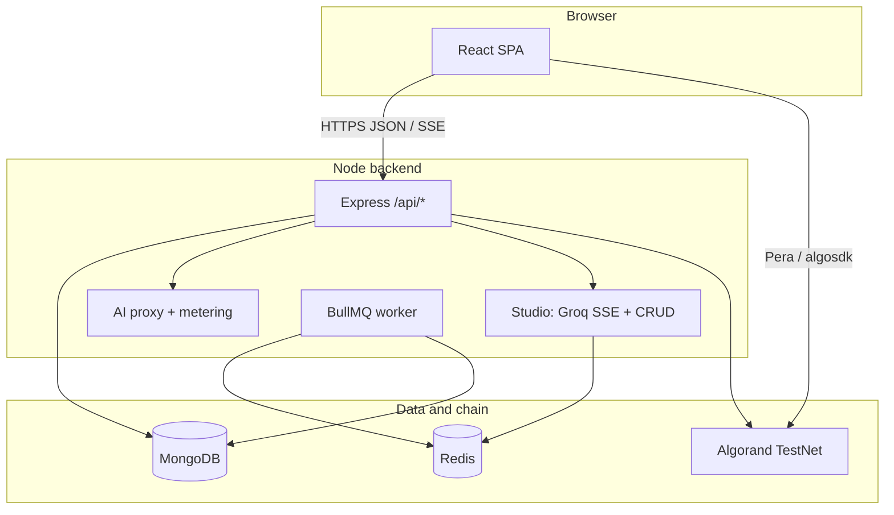

# SentinelAI (Sentinel)

**Pay-per-use AI API marketplace on Algorand**, with a separate **Studio** workspace for creators (blogging agent, projects, queued publishing). Users and creators authenticate via JWT; metered API calls settle with on-chain ALGO payments to creator wallets. Optional **Algorand smart contract** records aggregate top-up stats on-chain.

---

## Team Sentinels

| Name            |
|-----------------|
| Aarya Pawar     |
| Manas Shete     |
| Debjit Debnath  |
| Aayush Lathi    |

---

## Table of contents

1. [What this repository contains](#1-what-this-repository-contains)
2. [Repository structure](#2-repository-structure)
3. [Architecture](#3-architecture)
4. [Prerequisites](#4-prerequisites)
5. [Setup guide](#5-setup-guide)
6. [Environment variables](#6-environment-variables)
7. [Smart contract](#7-smart-contract)
8. [API surface (summary)](#8-api-surface-summary)
9. [Frontend routes](#9-frontend-routes)
10. [Production notes](#10-production-notes)
11. [Git workflow and commits](#11-git-workflow-and-commits)
12. [Further reading](#12-further-reading)

---

## 1. What this repository contains

| Area | Purpose |
|------|---------|
| **`frontend/`** | Vite + React 18 + Tailwind. **Marketplace** (`/dashboard/*`) for API discovery, keys, usage, billing. **Studio** (`/studio/*`) for blogging, projects, platforms, analytics (Groq-backed). |
| **`backend/`** | Express API, MongoDB (Mongoose), JWT auth, Algorand helpers, AI proxy for marketplace services, **Studio** routes (`/api/studio`), BullMQ publishing worker. |
| **`contract/`** | Puya / **algopy** smart contract (`SentinelContract`) + deploy script + compiled `artifacts/`. |
| **`chatbot/`** | Optional hosted chat apps (separate `package.json` per app); not required for core marketplace. |

**Ecosystem split (product):**

- **Marketplace** — API developers: services, keys, metering, transactions, creators.
- **Studio** — Content workflows: Groq-only blog generation (SSE), drafts, scheduling, BullMQ publishing (Redis), encrypted platform tokens.

---

## 2. Repository structure

```
pay-per-usage-ai-api-access-system-using-algorand/
├── README.md                 ← This file
├── DOCUMENTATION.md          ← Deep-dive: flows, full endpoint tables, glossary
├── backend/
│   ├── package.json
│   └── src/
│       ├── server.js         ← Express entry, routes, static SPA in production
│       ├── config/           ← db, firebase admin, contract config
│       ├── middleware/       ← auth, rate limits, studio quota
│       ├── models/           ← User, Service, Transaction, Studio models, …
│       ├── routes/           ← auth, services, use, payment, studio, …
│       ├── controllers/      ← studio.controller.js
│       ├── services/         ← aiProxy, billing, blog.service, algorand, …
│       ├── providers/        ← groqProvider.js (Studio AI)
│       ├── queues/           ← BullMQ publishing queue
│       ├── workers/          ← publishingWorker.js
│       └── utils/            ← encrypt, jwt helpers, …
├── frontend/
│   ├── package.json
│   ├── vite.config.js        ← dev server + /api → localhost:5000
│   └── src/
│       ├── main.jsx          ← QueryClientProvider, Router, Auth
│       ├── App.jsx           ← Nested /dashboard, /studio, /billing, redirects
│       ├── layouts/          ← MarketplaceLayout, StudioLayout
│       ├── pages/            ← marketplace + studio/* pages
│       ├── components/       ← sidebars, wallet, profile, …
│       ├── context/          ← AuthContext
│       └── api/client.js     ← axios + JWT
├── contract/
│   ├── sentinel_contract.py  ← ARC4 contract source
│   ├── deploy.py
│   ├── requirements.txt
│   ├── artifacts/            ← TEAL + ARC56 JSON (generated)
│   └── contract_info.json  ← written by deploy (app id + address)
└── chatbot/
    ├── chat-backend/
    └── chat-front/
```

---

## 3. Architecture

High-level data flow:



**Marketplace call (simplified):** user requests a quote / usage on `/api/use` → backend validates access and billing → may require or verify an Algorand payment to the creator → proxied request to the provider (keys decrypted server-side only).

**Studio:** blog generation streams from Groq through `/api/studio/blog/generate` (SSE). Publishing is **never inline** in the route: `POST /api/studio/blog/schedule` enqueues BullMQ jobs; `publishingWorker` updates `BlogPost` status and `publishedPlatforms`.

---

## 4. Prerequisites

| Tool | Version / notes |
|------|------------------|
| **Node.js** | ≥ 20 (`backend` and `frontend` engines) |
| **MongoDB** | Atlas or local URI for Mongoose |
| **Redis** | Required for Studio publishing queue and worker (BullMQ). Worker start is wrapped in try/catch in `server.js` if Redis is down. |
| **Python** | 3.10+ for `contract/` (puyapy, algopy, py-algorand-sdk) |
| **Algorand** | TestNet account with ALGO for deploy and demos (Pera or similar) |

---

## 5. Setup guide

### 5.1 Clone and install

```bash
git clone <your-fork-or-origin-url>
cd pay-per-usage-ai-api-access-system-using-algorand
```

**Backend**

```bash
cd backend
npm install
```

Create `backend/.env` (see [§6 Environment variables](#6-environment-variables)). Minimum for local API + DB:

- `MONGODB_URI` or `MONGO_URI`
- `JWT_SECRET`
- `ENCRYPTION_KEY` or `ENCRYPTION_SECRET` (provider keys + Studio platform tokens)

Start API:

```bash
npm run dev
# default: http://localhost:5000 — health: GET /api/health
```

**Frontend**

```bash
cd frontend
npm install
npm run dev
# default: http://localhost:5173 — proxies /api → 5000 (see vite.config.js)
```

Optional: set `VITE_API_URL` if the API is not same-origin (e.g. deployed API URL).

**Smart contract (optional)**

```bash
cd contract
python -m venv .venv
# Windows: .venv\Scripts\activate
# macOS/Linux: source .venv/bin/activate
pip install -r requirements.txt
```

Set `DEPLOYER_MNEMONIC` (and optionally `ALGOD_SERVER`, `ALGOD_TOKEN`, `SENTINEL_MIN_MICRO_ALGOS`) then:

```bash
python deploy.py
```

This writes `contract/contract_info.json`. The backend resolves `ALGO_APP_ID` / `ALGO_CONTRACT_ADDRESS` from env or that file (`src/config/contractConfig.js`).

**Studio publishing**

- Run Redis locally or provide `REDIS_URL`.
- Set `GROQ_API_KEY` for blog generation and metadata helpers.

### 5.2 Verify

1. Open `http://localhost:5173` — home / login flows.  
2. `curl http://localhost:5000/api/health` → `{"ok":true}`.  
3. After deploy, `GET /api/contract/stats` if contract env is configured.

---

## 6. Environment variables

### 6.1 Core backend

| Variable | Purpose |
|----------|---------|
| `PORT` | API port (default `5000`) |
| `MONGODB_URI` / `MONGO_URI` | MongoDB connection string |
| `JWT_SECRET` | Signs session JWTs |
| `ENCRYPTION_KEY` or `ENCRYPTION_SECRET` | AES-GCM for secrets at rest |
| `NODE_ENV` | `production` serves `frontend/dist` from Express |
| `FRONTEND_ORIGIN` / `FRONTEND_URL` | CORS allowlist |

### 6.2 Algorand (optional but used in flows)

| Variable | Purpose |
|----------|---------|
| `ALGOD_SERVER` / `ALGORAND_NODE` | Algod URL (defaults to public testnet) |
| `ALGOD_TOKEN` | If using a private node |
| `ALGO_APP_ID` / `ALGO_CONTRACT_ADDRESS` | Override on-chain app |
| `CONTRACT_INFO_PATH` | Custom path to `contract_info.json` |

### 6.3 Firebase (if using Google auth as implemented)

Configure Firebase Admin and client keys as used in `backend/src/config/firebaseAdmin.js` and `frontend/src/config/firebase.js` (see `DOCUMENTATION.md` for field names used in code).

### 6.4 SentinelAI Studio

| Variable | Purpose |
|----------|---------|
| `GROQ_API_KEY` | Groq SDK for Studio generation |
| `REDIS_URL` | BullMQ connection |
| `RECEIVER_WALLET` | Algorand address that receives plan upgrade payments (backend) |
| `ALGO_INDEXER_URL` | Indexer for tx verification (default TestNet algonode) |
| `MEDIUM_CLIENT_ID` / `MEDIUM_CLIENT_SECRET` | Future OAuth |
| `LINKEDIN_CLIENT_ID` / `LINKEDIN_CLIENT_SECRET` | Future OAuth |
| `HASHNODE_ACCESS_TOKEN` | Platform integration |
| `DEVTO_API_KEY` | Dev.to integration |

### 6.5 Frontend

| Variable | Purpose |
|----------|---------|
| `VITE_API_URL` | Base URL for axios when API is not proxied |
| `VITE_FIREBASE_*` | Firebase web client (see `firebase.js`) |
| `VITE_RECEIVER_WALLET` | Same burner/receiver address as `RECEIVER_WALLET` (upgrade payments) |
| `VITE_ALGO_NODE_URL` | Algod URL (default `https://testnet-api.algonode.cloud`) |

**Studio plan prices (ALGO / month):** Creator 5 · Pro 15 · Enterprise 40 — paid via Pera to `RECEIVER_WALLET`, verified at `POST /api/studio/subscription/upgrade`.

**Never commit** `.env` files or mnemonics. Add `.env` to `.gitignore` and use team secrets management in CI.

---

## 7. Smart contract

**Language:** Python with **algopy**, compiled via **puyapy** to TEAL. **ARC-4** contract name: `SentinelContract`.

**Global state (uint64):**

| Field | Meaning |
|-------|---------|
| `min_payment` | Minimum payment amount in **microAlgos** for a valid `purchase` |
| `total_purchases` | Count of successful purchases |
| `total_algo_received` | Sum of payment amounts (microAlgos) |

**Methods (from `sentinel_contract.py` + ARC56):**

| Method | Type | Description |
|--------|------|-------------|
| `create_application(min_amount)` | Create | On deploy, sets `min_payment` and zeros counters. |
| `purchase(pay)` | Call | Reference payment txn: receiver must be the app account; `pay.amount >= min_payment`; increments stats. |
| `read_stats()` | Readonly | Returns `(min_payment, total_purchases, total_algo_received)`. |

**Atomic group:** `purchase` is designed to run in a group with a **Payment** transaction referenced as the `pay` argument.

**Artifacts:** `contract/artifacts/` contains compiled TEAL and `SentinelContract.arc56.json` (ABI for explorers / clients).

**Backend read:** `GET /api/contract/stats` uses `contractConfig` and algod to read global state when configured.

---

## 8. API surface (summary)

Mounted in `backend/src/server.js`:

| Prefix | Role |
|--------|------|
| `/api/auth` | Login, register, Firebase bridges, name checks |
| `/api/services` | Public + creator service CRUD |
| `/api/payment` | Payment-related flows |
| `/api/access` | Access tokens / keys |
| `/api/creator` | Creator dashboard data |
| `/api/use` | Metered AI use (core marketplace) |
| `/api/prediction` | Usage prediction / analytics API |
| `/api/user` | User role: balance, proxy keys, transactions, usage |
| `/api/contract` | On-chain stats |
| `/api/wallet` | Wallet link / burner helpers |
| `/api/profile` | Profile summary, update, burner |
| `/api/dev` | Dev-only utilities (guarded) |
| `/api/studio` | Studio: blogs, projects, platforms, analytics, calendar (JWT) |

For **every route, request body, and sequence diagrams**, use **`DOCUMENTATION.md`** in this repo.

---

## 9. Frontend routes

| Prefix | Layout | Audience |
|--------|--------|----------|
| `/dashboard/*` | `MarketplaceLayout` + `MarketplaceSidebar` | End users: home, browse, keys, usage, creators, service detail |
| `/billing/transactions` | Same marketplace shell | Transaction history |
| `/studio/*` | `StudioLayout` | Studio: home, blogging agent, projects, calendar, drafts, published, platforms, analytics, apps, queue, … |
| `/creator`, `/creator/new` | Creator dashboards | API creators |
| `/` | `Home` | Landing, auth entry |

Legacy **`/marketplace/*`** and **`/user/*`** paths redirect to the `/dashboard/*` equivalents where applicable.

---

## 10. Production notes

- Set `NODE_ENV=production` and run `npm run build` in `frontend/`. Express serves static files from `frontend/dist` relative to `backend/src/server.js` (see `path.join(__dirname, "..", "..", "frontend", "dist")`).
- Align `FRONTEND_ORIGIN` with your deployed SPA URL.
- Use strong `JWT_SECRET` and a dedicated `ENCRYPTION_KEY` / `ENCRYPTION_SECRET`.
- Redis should be managed (TLS URL for cloud Redis) for Studio publishing.

---

## 11. Git workflow and commits

**Branches**

- `main` — release-ready code.  
- `feature/<short-name>` — new features (e.g. `feature/studio-analytics`).  
- `fix/<short-name>` — bugfixes.

**Commits**

- Prefer **Conventional Commits**: `feat:`, `fix:`, `docs:`, `refactor:`, `chore:`, `test:`.
- One logical change per commit when possible; keep messages imperative (“Add studio calendar route” not “Added”).
- Do not commit **secrets**, `node_modules`, or local `.env`. Regenerate `contract_info.json` in CI only from secure vars if needed.

**Pull requests**

- Describe **what** and **why**, list test steps, link issues.
- Keep Marketplace and Studio concerns in **separate commits or PRs** when changes are large, to ease review.

**Housekeeping**

- Run `npm run build` in `frontend` before merging UI changes.
- After contract source edits, recompile and commit `artifacts/` if your team tracks binaries; otherwise document “run deploy locally” in the PR.

---

## 12. Further reading

- **`DOCUMENTATION.md`** — End-to-end technical reference: login flows, pay-per-use sequence, encryption, prediction engine, **full API listing**, security notes.
- **`contract/deploy.py`** — Env vars and compile/deploy steps inline in the script header.

---

## License

Add a license file (e.g. `LICENSE`) if you open-source the project.
