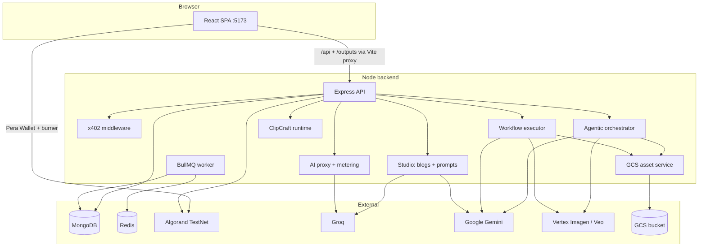
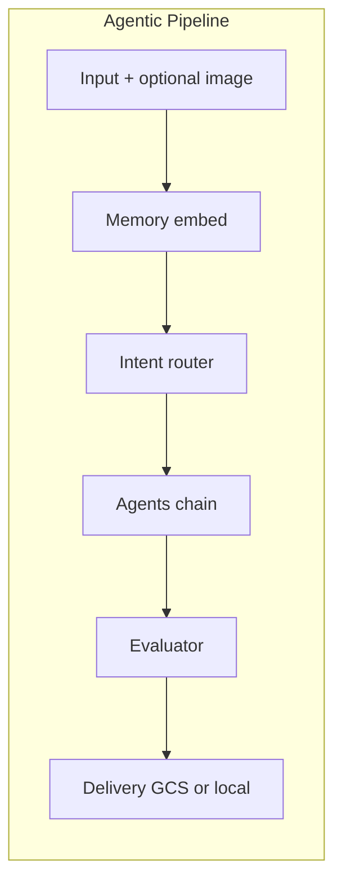

# SentinelAI

**Pay-per-use AI API marketplace on Algorand** — creators publish AI services, users pay in ALGO micro-transactions per call, and payments settle peer-to-peer on Algorand TestNet. The **Studio** adds subscription tiers for content workflows, prompt engineering, ClipCraft, and workflow automation.

**Production:** [sentinalai.dev](https://sentinalai.dev) (frontend) · API backend on Render (`sentinal-z3ue.onrender.com` recommended for `VITE_API_URL`).

---

## Team Sentinels

| Name            |
|-----------------|
| Aarya Pawar     |
| Manas Shete     |
| Debjit Debnath  |
| Aayush Lathi    |

---

## Table of Contents

1. [What this repository contains](#1-what-this-repository-contains)
2. [Business Model](#2-business-model)
3. [Repository structure](#3-repository-structure)
4. [Architecture](#4-architecture)
5. [Prerequisites](#5-prerequisites)
6. [Setup guide](#6-setup-guide)
7. [Environment variables](#7-environment-variables)
8. [Smart contract](#8-smart-contract)
9. [API surface (summary)](#9-api-surface-summary)
10. [Frontend routes](#10-frontend-routes)
11. [x402 Payment Protocol](#11-x402-payment-protocol)
12. [Developer SDK](#12-developer-sdk)
13. [Agent Context JSON](#13-agent-context-json)
14. [Production notes](#14-production-notes)
15. [Git workflow and commits](#15-git-workflow-and-commits)
16. [Further reading](#16-further-reading)
17. [Agentic Pipeline & multimodal workflows (detailed)](#17-agentic-pipeline--multimodal-workflows-detailed)

---

## 1. What this repository contains

| Area | Purpose |
|------|---------|
| **`frontend/`** | Vite + React 18 + Tailwind. **Marketplace** (`/dashboard/*`) for API discovery, keys, usage, billing. **Studio** (`/studio/*`) for blogging, **Workflow Studio** (DAG builder + agentic nodes), **Agentic Pipeline** (7-phase multimodal builder), ClipCraft, **Advanced Prompt Generator**, AI chat (x402), analytics. **Docs** (`/docs/*`) for x402 and How It Works. |
| **`backend/`** | Express API, MongoDB, JWT auth, Algorand helpers, AI proxy, **x402** routes, **Studio** (Groq blogs, Gemini prompts, **agentic orchestrator**, **workflow executor**, GCS asset uploads, ClipCraft, subscriptions), BullMQ publishing worker. |
| **`contract/`** | Puya / **algopy** smart contract (`SentinelContract`) + deploy script + `artifacts/`. |
| **`sdk/`** | Official JavaScript/TypeScript SDK package published on npm as `@sentinalapi/sdk`. Simplifies payments integration. |

**Ecosystem split (product):**

| Product | Description |
|---------|-------------|
| **Marketplace** | Browse, buy, and use creator AI APIs. Pay-per-use in ALGO (`/api/use`) or **x402** (`/api/x402/use/:serviceId`) for agents. |
| **Studio** | Groq blog generation (SSE), multi-platform publishing, **Gemini prompt tools**, **Workflow Studio** (pay-per-run in ALGO via burner wallet), **Agentic Pipeline** (text → image → video → audio chains), ClipCraft, plan upgrades in ALGO. |
| **Docs** | In-app guides for x402 integration and platform overview. |

---

## 2. Business Model

Sentinel operates as a **decentralized AI API marketplace** with a **Studio** subscription layer.

### Creators (Supply side)

- Publish AI services (Groq, OpenAI, Anthropic, Together AI).
- Set **ALGO per 1K tokens** + **minimum charge per call**.
- Provider keys stored **AES-256-GCM encrypted**.
- Marketplace payments go **user wallet → creator wallet** (P2P on TestNet).

### Users (Demand side)

- Pay **per call** in ALGO; API keys (`sk-sentinel-*`) or **burner wallet** for fewer manual signs.
- **x402** clients can call services without API keys — payment in the `X-PAYMENT` header is authentication.

### Platform (Sentinel)

- Marketplace: P2P to creators; optional **proof-of-intelligence** log fee (0.001 ALGO).
- **Studio subscriptions** (ALGO/month to `RECEIVER_WALLET`): Creator **5**, Pro **15**, Enterprise **40** ALGO.
- Optional **SentinelContract** tracks aggregate volume on-chain.

### Studio subscription limits (monthly)

| Tier | Blogs | Prompt Generator | Projects |
|------|-------|------------------|----------|
| **Free** | 3 | 10 | 2 |
| **Creator** | 50 | 200 | 10 |
| **Pro** | Unlimited | Unlimited | Unlimited |
| **Enterprise** | Unlimited | Unlimited | Unlimited |

Upgrades: `POST /api/studio/subscription/upgrade` (on-chain tx verified). Quotas reset on upgrade (30-day cycle).

### Key revenue streams

| Stream | Mechanism |
|--------|-----------|
| Studio subscriptions | ALGO/month for blogs, prompts, workflows, ClipCraft |
| Creator listings | Creators supply their own provider keys (zero-custody) |
| Proof-of-intelligence | Small on-chain fee per attested AI call |
| x402 marketplace | Programmatic agents pay minimum charge per call |

---

## 3. Repository structure

```
pay-per-usage-ai-api-access-system-using-algorand/
├── README.md
├── DOCUMENTATION.md          ← Deep-dive: flows, full endpoint tables
├── backend/
│   ├── package.json
│   └── src/
│       ├── server.js
│       ├── config/             ← db, firebase, corsOrigins, contract
│       ├── constants/        ← studioPlans.js, studioLimits.js
│       ├── middleware/       ← auth, studioQuota (blog + prompt)
│       ├── models/
│       ├── routes/             ← auth, services, use, x402.js, studio.routes.js,
│       │                         agenticPipeline.routes.js, workflows.js (templates + SSE)
│       ├── controllers/        ← studio, studioPrompt, studioSubscription, agenticPipeline
│       ├── services/
│       │   ├── agents/           ← textAgent, imageAgent, videoAgent, audioAgent, codeAgent
│       │   ├── agenticOrchestrator.js, routerService.js, evaluatorService.js
│       │   ├── deliveryService.js, gcsAssetService.js, memoryService.js
│       │   ├── workflowExecutor.js, workflowAgenticNodes.js, workflowCreativeNodes.js
│       │   └── geminiImageService.js, geminiPromptService.js, …
│       ├── middleware/upload.js  ← pipeline image uploads
│       ├── models/               ← PipelineRun.js, WorkflowRun.js, UserMemory.js
│       ├── studio/clipcraft/     ← ClipCraft (optional CLIPCRAFT_ENABLED)
│       ├── outputs/              ← pipeline/ + workflow/ static assets (gitignored)
│       └── utils/                ← pcmToWav.js, vertexAuth.js, scriptSceneParser.js
├── frontend/
│   ├── package.json
│   ├── vite.config.js          ← proxies /api and /outputs → backend
│   └── src/
│       ├── pages/studio/AgenticPipeline/
│       ├── components/agentic-pipeline/
│       ├── components/workflow/  ← canvas, nodes, ExecutionPanel, templates
│       ├── hooks/                ← useAgenticPipeline.js, useWorkflowExecutor.js
│       ├── utils/                ← mediaUrl.js, workflowUi.js, completionSound.js
│       ├── api/                  ← agenticPipeline.js, workflowApi.js
│       └── wallet/               ← pera.js, burner.js
├── contract/
│   ├── sentinel_contract.py    ← ARC4 contract source
│   ├── deploy.py
│   ├── requirements.txt
│   ├── artifacts/              ← TEAL + ARC56 JSON (generated)
│   └── contract_info.json      ← written by deploy (app id + address)
├── sdk/                        ← Official JavaScript/TypeScript SDK package
│   ├── package.json
│   ├── tsconfig.json
│   ├── tsup.config.ts
│   ├── README.md
│   ├── src/
│   │   ├── index.ts            ← Main public exports
│   │   ├── SentinelClient.ts   ← Main client implementation
│   │   ├── types.ts
│   │   ├── errors.ts           ← Custom SentinelError classes
│   │   ├── signer.ts           ← MnemonicSigner, BYOSigner, PreSignedSigner
│   │   ├── algorand.ts         ← Payment transaction builder
│   │   └── http.ts             ← Fetch wrapper
│   └── docs/                   ← Comprehensive SDK markdown guides
```

---

## 4. Architecture



**Marketplace (classic):** `POST /api/use` → quote → on-chain pay → claim with `txId`.

**Marketplace (x402):** `POST /api/x402/use/:serviceId` → HTTP 402 → client pays → retry with `X-PAYMENT` → 200 + response.

**Studio blogs:** SSE from `/api/studio/blog/generate` (Groq). Publishing via BullMQ (`/api/studio/blog/schedule`).

**Prompt Generator:** `/api/studio/prompt/*` (Gemini on server; `GOOGLE_API_KEY`; quota middleware).

**Agentic Pipeline:** `POST /api/studio/agentic/run` (SSE) → memory → router → agents → eval → GCS/local delivery.

**Workflow Studio:** Burner-wallet ALGO estimate → pay → `POST /api/studio/workflows/:id/run` → SSE `workflow-runs/:id/stream` → structured **Output** node.



---

## 5. Prerequisites

| Tool | Notes |
|------|--------|
| **Node.js** | ≥ 20 |
| **MongoDB** | Atlas or local |
| **Redis** | Studio publishing queue (BullMQ) |
| **Google AI Studio key** | Prompt Generator, Agentic text/TTS/images fallback (`GOOGLE_API_KEY`) |
| **Groq API key** | Studio blogs + Workflow **AI Agent** nodes (`GROQ_API_KEY`) |
| **GCP project (optional)** | Vertex Imagen/Veo + GCS (`GOOGLE_CLOUD_PROJECT`, service account JSON, bucket) |
| **Vertex API key (optional)** | Express-mode Vertex auth (`VERTEX_API_KEY`) if not using JSON credentials |
| **Python 3.10+** | Optional: `contract/` deploy |
| **Algorand TestNet** | Pera Wallet + ALGO for demos and plan upgrades |

---

## 6. Setup guide

### 6.1 Clone and install

```bash
git clone https://github.com/lathi-aayush/pay-per-usage-ai-api-access-system-using-algorand.git
cd pay-per-usage-ai-api-access-system-using-algorand
```

**Backend** (default port **5000**; use **5001** if 5000 is busy — match Vite proxy)

```bash
cd backend
npm install
cp .env.example .env
# Set MONGO_URI, JWT_SECRET, ENCRYPTION_KEY, GROQ_API_KEY, GOOGLE_API_KEY, RECEIVER_WALLET, …
npm run dev
curl http://localhost:5000/api/health
```

**Frontend**

```bash
cd frontend
npm install
# Local dev: leave VITE_API_URL unset — Vite proxies /api to backend (see vite.config.js)
# If backend runs on 5001: add VITE_PROXY_TARGET=http://localhost:5001
npm run dev
# Open http://localhost:5173
```

**Do not** point `VITE_API_URL` at `sentinalai.dev` or `sentinalai.com` during local dev — those hosts serve the static site, not the API (causes CORS errors). Use the Vite proxy or `VITE_PROXY_TARGET=https://sentinal-z3ue.onrender.com` for remote API.

**Smart contract (optional)**

```bash
cd contract
python -m venv .venv
# Windows: .venv\Scripts\activate
pip install -r requirements.txt
python deploy.py
```

### 6.2 Verify

| Check | Expected |
|-------|----------|
| `http://localhost:5173` | SPA loads, login works |
| `GET /api/health` | `{"ok":true}` |
| `GET /api/services/agent-context` | JSON catalog |
| Studio → **Advanced Prompt Generator** | Generates after `GOOGLE_API_KEY` is set |
| Studio → **Agentic Pipeline** | SSE run completes; outputs play/download |
| Studio → **Workflows → template → Run** | Burner ALGO; Execution panel shows results |
| Studio → **Plan & upgrade** | Shows blog + prompt quotas |

---

## 7. Environment variables

### 7.1 Core backend (`backend/.env`)

| Variable | Purpose |
|----------|---------|
| `PORT` | API port (default `5000`) |
| `MONGO_URI` / `MONGODB_URI` | MongoDB |
| `JWT_SECRET` | Session JWTs |
| `ENCRYPTION_KEY` | AES-GCM (32 chars) — burner wallet, provider keys |
| `NODE_ENV` | `production` serves `frontend/dist` |
| `FRONTEND_ORIGIN` / `CORS_ALLOWED_ORIGINS` | CORS (includes `localhost:5173`, `sentinalai.dev`) |
| `RECEIVER_WALLET` | Studio subscription payments (TestNet address) |

### 7.2 Algorand

| Variable | Purpose |
|----------|---------|
| `ALGOD_SERVER` / `ALGORAND_NODE` | Algod URL |
| `ALGO_INDEXER_URL` | Indexer for tx verify |
| `ALGO_APP_ID` / `ALGO_CONTRACT_ADDRESS` | Optional contract |
| `PLATFORM_MNEMONIC` / `PROOF_LOG_ADDRESS` | Proof-of-intelligence |

### 7.3 Studio AI

| Variable | Purpose |
|----------|---------|
| `GROQ_API_KEY` | Blogging Agent (Groq SSE) |
| `GOOGLE_API_KEY` | Prompt Generator, Agentic Pipeline, workflow Gemini nodes, default images |
| `GEMINI_MODEL` | Optional override (`gemini-2.5-flash`, etc.) |
| `GEMINI_IMAGE_MODEL` | Optional image model for thumbnails / Image Generator |
| `REDIS_URL` | Publishing queue |

### 7.4 ClipCraft (optional)

| Variable | Purpose |
|----------|---------|
| `CLIPCRAFT_ENABLED` | `true` to start ClipCraft runtime |
| See `backend/.env.example` | Provider mode, credits, queue adapters |

### 7.5 Agentic Pipeline, workflows, GCS, and Vertex

| Variable | Purpose |
|----------|---------|
| `GOOGLE_API_KEY` | **Required** for Gemini: text router, eval, memory, TTS, **default workflow images** (Image Generator + agentic image fallback) |
| `GOOGLE_CLOUD_PROJECT` | GCP project ID (e.g. `sentinal-ai-497820`) for Vertex Imagen/Veo |
| `GOOGLE_APPLICATION_CREDENTIALS` | Path to service account JSON (relative to `backend/.env`) — **recommended for Veo** |
| `VERTEX_API_KEY` | Optional Vertex Studio / express API key (used if ADC is missing) |
| `VERTEX_LOCATION` | Default `us-central1` |
| `VERTEX_IMAGEN_ENABLED` | `true` to try **Imagen** on Vertex before Gemini images; default `false` |
| `VERTEX_IMAGEN_MODEL` | e.g. `imagen-3.0-generate-002` |
| `GCS_ASSETS_BUCKET` | Bucket for all heavy assets + **Veo output** (`gs://bucket/sentinal/veo-output/`) |
| `GCS_ASSET_PREFIX` | Object prefix (default `sentinal`) |
| `GCS_SIGNED_URL_TTL_SEC` | Signed URL lifetime (default `3600`) |
| `VEO_MODEL_IDS` | Comma-separated Veo models to try (newest first) |
| `PIPELINE_OUTPUT_DIR` | Local fallback when GCS off (`./outputs/pipeline`) |
| `CODE_SANDBOX` | `docker` for Agentic Code agent (optional) |

**Auth summary**

| Capability | Primary auth | Fallback |
|------------|--------------|----------|
| Text, router, eval, memory | `GOOGLE_API_KEY` | — |
| Images (workflows) | `GOOGLE_API_KEY` (Gemini image models) | Vertex Imagen if `VERTEX_IMAGEN_ENABLED=true` |
| Audio (TTS) | `GOOGLE_API_KEY` | PCM wrapped to valid WAV in `pcmToWav.js` |
| Video (Veo) | Service account + **Veo allowlist** + `GCS_ASSETS_BUCKET` | — |

**Veo is not unlocked by an API key alone.** Request access in [Vertex Model Garden](https://console.cloud.google.com/vertex-ai/model-garden) for your project. Grant the service account **Vertex AI User** and **Storage Object Admin** on the bucket.

### 7.6 Frontend (`frontend/.env`)

| Variable | Purpose |
|----------|---------|
| `VITE_API_URL` | **Production build only** — Render backend URL (e.g. `https://sentinal-z3ue.onrender.com`) |
| `VITE_PROXY_TARGET` | **Local dev** — backend URL for Vite proxy (default `http://localhost:5001`) |
| `VITE_RECEIVER_WALLET` | Must match backend `RECEIVER_WALLET` for plan upgrades |
| `VITE_FIREBASE_*` | Firebase web client |
| `VITE_PUBLIC_SITE_URL` | Optional — blog links (`https://sentinalai.dev`) |

**Never commit** `.env` files, mnemonics, or API keys.

---

## 8. Smart contract

**Language:** Python **algopy** → TEAL via **puyapy**. **ARC-4** `SentinelContract`.

| Method | Description |
|--------|-------------|
| `create_application(min_amount)` | Deploy; set minimum payment |
| `purchase(pay)` | Payment txn ≥ min; increment stats |
| `read_stats()` | Read global counters |

**Backend:** `GET /api/contract/stats` when contract env is configured.

---

## 9. API surface (summary)

| Prefix | Role |
|--------|------|
| `/api/auth` | Login, Firebase |
| `/api/services` | Marketplace CRUD; `/agent-context` |
| `/api/use` | Classic pay-per-use (quote → pay → claim) |
| `/api/x402` | x402-gated AI (`/services`, `/use/:serviceId`) |
| `/api/payment`, `/api/access`, `/api/creator`, `/api/user` | Billing, keys, creator dashboard |
| `/api/profile` | Profile, **burner wallet** sync |
| `/api/contract`, `/api/wallet`, `/api/prediction` | Chain stats, wallet, forecasts |
| `/api/studio` | Blogs, projects, platforms, analytics, calendar, **subscription**, **workflows**, **clipcraft** |
| `/api/studio/prompt` | **generate**, **enhance**, **improve**, **analyze**, **variations** (auth + quota) |
| `/api/studio/agentic` | **Agentic Pipeline**: `POST /run` (SSE), `GET /runs`, `GET /runs/:id` |
| `/api/studio/workflows` | CRUD workflows, `POST /:id/estimate`, `POST /:id/run`, payment gate |
| `/api/studio/workflow-runs` | Run history, `GET /:id/stream` (SSE), `GET /:id` |
| `/api/studio/workflow-templates` | Seeded templates (Agentic, Creative, YouTube, etc.) |
| `/api/studio/workflow/creative` | One-shot prompt → image (quota) |
| `/outputs/pipeline`, `/outputs/workflow` | Static generated media (proxied in dev via Vite) |

Studio usage: `GET /api/studio/usage` → `tier`, `monthlyBlogsUsed`, `monthlyBlogLimit`, `monthlyPromptsUsed`, `monthlyPromptLimit`.

Details: **`DOCUMENTATION.md`**.

---

## 10. Frontend routes

### Marketplace (`/dashboard/*`)

Home (Agent Context JSON), browse, keys, usage, creators, service detail, billing transactions.

### Studio (`/studio/*`)

| Path | Feature |
|------|---------|
| `/studio` | Studio home |
| `/studio/workflows` | Workflow Studio hub |
| `/studio/workflows/templates` | Pre-built DAG templates |
| `/studio/workflows/history` | Past runs + execution replay |
| `/studio/workflows/:id` | Visual builder (React Flow) |
| `/studio/agentic-pipeline` | Standalone 7-phase Agentic Pipeline UI |
| `/studio/creative-workflow` | Prompt → image quick flow |
| `/studio/blogging-agent` | Groq blog editor + publish |
| `/studio/prompt-generator` | Advanced Prompt Generator (Gemini, subscription quota) |
| `/studio/clipcraft` | ClipCraft video clips pipeline |
| `/studio/chat` | AI Chat (x402-backed services) |
| `/studio/projects`, `/studio/calendar`, `/studio/drafts`, `/studio/published` | Content organization |
| `/studio/platforms` | Connected publish targets |
| `/studio/analytics` | Studio analytics |
| `/studio/plan` | Subscription upgrade (ALGO via Pera) |
| `/studio/queue`, `/studio/exports`, `/studio/storage`, `/studio/apps` | Ops / tooling |

### Docs (`/docs/*`)

| Path | Content |
|------|---------|
| `/docs/x402` | x402 user guide |
| `/docs/x402-api` | x402 developer reference |
| `/docs/how-it-works` | Platform overview |

### Other

| Path | Audience |
|------|----------|
| `/creator`, `/creator/new` | API creators |
| `/` | Landing + auth |

Legacy `/marketplace/*` and `/user/*` redirect to `/dashboard/*`.

---

## 11. x402 Payment Protocol

**Status: implemented** at `/api/x402` (packages `@x402/core`, `@x402/avm`).

| Endpoint | Description |
|----------|-------------|
| `GET /api/x402/services` | List x402-enabled services |
| `POST /api/x402/use/:serviceId` | Pay-per-call with HTTP 402 challenge / `X-PAYMENT` retry |

**Flow:** Client requests without payment → **402** + `Payment-Required` header → client signs Algorand tx → retry with `X-PAYMENT` → AI response. **No API key required** — sender address from the tx is the identity.

**Studio AI Chat** (`/studio/chat`) uses the same x402 service list for in-browser paid chat.

**Classic `/api/use`** remains for per-token metering and marketplace users with API keys.

In-app docs: `/docs/x402` and `/docs/x402-api`. Test page: `frontend/x402-test.html`.

---

## 12. Developer SDK

Sentinel provides an official JavaScript/TypeScript SDK package (**`@sentinalapi/sdk`**) published on npm to make building client-side and server-side pay-per-use AI integrations extremely simple.

### Quick Start

```bash
npm install @sentinalapi/sdk algosdk
```

```ts
import { MnemonicSigner, SentinelClient } from "@sentinalapi/sdk";

// Initialize Sentinel Client
const client = new SentinelClient({
  apiKey: "sk-sentinel-your-key-here",
  network: "testnet"
});

// Configure signer (e.g. server-side mnemonic)
const signer = new MnemonicSigner("your 25-word mnemonic phrase...");

// Make a metered, pay-per-use AI call
const response = await client.chat(
  [{ role: "user", content: "Tell me something cool!" }],
  signer
);

console.log(SentinelClient.getAssistantText(response));
console.log("On-chain Tx ID:", response.sentinelReceipt.paymentTxId);
```

For more info, check the full **[SDK README](./sdk/README.md)** or read the comprehensive guides inside **[sdk/docs/](./sdk/docs/)**.

---

## 13. Agent Context JSON

**`GET /api/services/agent-context`** — public, live catalog for AI assistants.

Includes per-service pricing, models, `how_to_use`, and `generated_at`. Copy from **Dashboard → Agent Context JSON** panel.

---

## 14. Production notes

### Deploy layout

| Service | Typical host | Env |
|---------|--------------|-----|
| **Frontend** | `sentinalai.dev` (Render/Vercel static) | `VITE_API_URL` = **backend** URL (not the `.dev` site URL) |
| **Backend** | `sentinal-z3ue.onrender.com` | `GOOGLE_API_KEY`, `GROQ_API_KEY`, `MONGO_URI`, `RECEIVER_WALLET`, `FRONTEND_ORIGIN=https://sentinalai.dev` |

### Checklist

- `npm run build` in `frontend/`; `NODE_ENV=production` on backend.
- Set **`GOOGLE_API_KEY`** on backend for Prompt Generator, Agentic Pipeline, and Gemini images.
- For production multimodal: **`GCS_ASSETS_BUCKET`**, service account JSON, Veo allowlist on GCP project.
- Redis (TLS) for Studio publishing.
- Strong `JWT_SECRET` and `ENCRYPTION_KEY`.
- CORS: `sentinalai.dev`, Render URLs, and `http://localhost:5173` are in `backend/src/config/corsOrigins.js` defaults.
- Match `VITE_RECEIVER_WALLET` (frontend build) with `RECEIVER_WALLET` (backend).

### Local vs production API

| Environment | API access |
|-------------|------------|
| `npm run dev` | Same-origin `/api` → Vite proxy → local or `VITE_PROXY_TARGET` |
| Production SPA | Absolute `VITE_API_URL` → Render backend |

---

## 15. Git workflow and commits

**Branches:** `main` (release), `feature/*`, `fix/*`, team branches (`deb`, `aayush`, etc.).

**Commits:** Conventional Commits (`feat:`, `fix:`, `docs:`). No secrets in git.

**Pull requests:** Describe what/why, test steps; keep Marketplace vs Studio changes reviewable.

---

## 16. Further reading

- **`DOCUMENTATION.md`** — Full API tables, sequences, security.
- **`backend/.env.example`** — All backend flags including ClipCraft and Gemini.
- **`frontend/.env.example`** — Dev proxy vs production `VITE_API_URL`.
- **[x402.org](https://x402.org)** — x402 specification.
- **[Google AI Studio](https://aistudio.google.com/apikey)** — Gemini API key for Prompt Generator.
- **[Algorand TestNet Dispenser](https://bank.testnet.algorand.network/)** — TestNet ALGO.

---

## 16. Agentic Pipeline & multimodal workflows (detailed)

This section documents everything built for **multimodal AI in Studio**: the standalone **Agentic Pipeline**, **Workflow Studio agentic nodes**, **Google Cloud Storage** for assets, **Vertex AI** (Imagen/Veo), and the **execution UX** (panel, sounds, Result node).

### 16.1 Standalone Agentic Pipeline (`/studio/agentic-pipeline`)

A **7-phase** server-orchestrated pipeline. The user submits text (and optional reference image); the backend streams progress over **SSE** and stores the run in MongoDB (`PipelineRun`).

| Phase | What happens |
|-------|----------------|
| 1 | Input received |
| 2 | **Memory** — embed user text, fetch similar past chunks (`UserMemory`, `text-embedding-004`) |
| 3 | **Router** — Gemini decides agent chain (`text`, `image`, `video`, `audio`, `code`) + keyword fallback for “script + keyframes + video + narrate” |
| 4 | **Agents** — run chain in order; each agent receives prior output |
| 5 | **Evaluator** — quality score; up to 2 retries on failure |
| 6 | **Memory write** — summary stored for future runs |
| 7 | **Delivery** — assets uploaded to GCS or saved under `backend/outputs/pipeline/` |

**API**

| Method | Path | Description |
|--------|------|-------------|
| `POST` | `/api/studio/agentic/run` | Start run (`multipart`: `inputText`, optional `image`). SSE progress + `complete` event (counts against **prompt quota** via `checkPromptQuota`) |
| `GET` | `/api/studio/agentic/runs` | List runs for user |
| `GET` | `/api/studio/agentic/runs/:id` | Full run including `outputs`, `structuredResult`, eval fields |

**Agents** (`backend/src/services/agents/`)

| Agent | Model / service | Output |
|-------|-----------------|--------|
| **Text** | Gemini Flash | Script, research, markdown scenes (`scriptSceneParser.js`) |
| **Image** | Vertex Imagen (optional) → **Gemini image** fallback | Base64 or URLs after GCS upload |
| **Video** | Vertex **Veo** (`predictLongRunning` + poll) | `gs://…` URI → signed HTTPS URL |
| **Audio** | Gemini TTS | Valid **WAV** (raw L16 PCM wrapped with RIFF header) |
| **Code** | Gemma + optional Docker sandbox | Python snippet in `meta.code` |

**Key backend files**

- `agenticOrchestrator.js` — main loop
- `routerService.js` — `inferChainFromPrompt()` for multimodal keywords
- `evaluatorService.js` — JSON-safe eval parsing
- `deliveryService.js` — package results; triggers GCS upload
- `gcsAssetService.js` — upload + signed URLs
- `controllers/agenticPipeline.controller.js` — HTTP + SSE

**SSE events** (both Agentic Pipeline and workflow runs use a similar pattern)

| Event | Payload (typical) |
|-------|-------------------|
| `phase` | Current phase name + message |
| `agent` | Agent id + status (`running` / `success` / `error`) |
| `log` | Human-readable line for UI console |
| `complete` | `runId`, `outputs`, `structuredResult`, eval score |
| `error` | Message + optional partial outputs |

**Frontend**

- `pages/studio/AgenticPipeline/` — builder + run history
- `hooks/useAgenticPipeline.js` — SSE client, completion **sound** (`completionSound.js`)
- `components/agentic-pipeline/OutputViewer.jsx` — images, video, audio with **download**
- `api/agenticPipeline.js` — REST helpers for runs list/detail

---

### 16.2 Workflow Studio — agentic & creative nodes

Workflows are **DAGs** (React Flow). Each run costs **estimated ALGO** from the user’s **burner wallet** (same pattern as other Studio on-chain payments).

**Node types**

| Node | Backend handler | Notes |
|------|-----------------|-------|
| **Input** | Pass-through; optional YouTube URL enrichment | |
| **Prompt Generator** | `workflowCreativeNodes.js` → Gemini | |
| **Image Generator** | Gemini `generateImageFromPrompt` → `publishCreativeImage()` | GCS or `/outputs/workflow/` |
| **Agentic · Text** | `runTextAgent` | |
| **Agentic · Image** | `runImageAgent` | Keyframes from script scenes |
| **Agentic · Video** | `runVideoAgent` | Requires Veo allowlist + GCS bucket |
| **Agentic · Audio** | `runAudioAgent` | TTS → WAV → GCS/local URL |
| **Agentic · Code** | `runCodeAgent` | |
| **AI Agent** | Groq completion | Structured output formats |
| **Logic** | Delay / branch placeholder | |
| **Output** | `buildStructuredRunResult()` | Aggregates upstream into `structuredResult` |
| **Blog** | `workflowBlogService.js` | Creates Studio blog post |

**Execution flow**

1. `POST /api/studio/workflows/:id/estimate` — token/credit estimate + DAG validation  
2. User confirms → burner sends ALGO → `POST /api/studio/workflows/:id/run`  
3. `workflowExecutor.js` runs topological order; **SSE** events on `/api/studio/workflow-runs/:runId/stream`  
4. Heavy JSON (images/audio) **compacted** before MongoDB save (`compactOutputForStorage`)  
5. Agentic assets published via `publishAgenticAssets()` / `publishCreativeImage()`  
6. On complete: `structuredResult` on `WorkflowRun` + all node statuses synced  

**Frontend execution UX**

- `hooks/useWorkflowExecutor.js` — estimate, pay, run, SSE subscribe
- `components/workflow/controls/ExecutionPanel.jsx` — logs, media previews, structured JSON
- `utils/workflowUi.js` — `openWorkflowExecutionPanel` custom event (toolbar / Output node / tab)
- `WorkflowBuilder.jsx` — listens for panel open; **Re-run** reopens panel when `hasRunData`

**Templates** (seeded in `workflows.js`, category **Agentic** among others)

- Agentic: Script → Images → Video → Audio  
- Agentic: Wildlife Cinematic Clip  
- Agentic: Podcast Voiceover  
- Agentic: Keyframes Only (Fast)  
- Social Thumbnail + Caption, Research Report, YouTube Short, Python Sandbox, SEO Blog, etc.

---

### 16.3 Google Cloud Storage (GCS)

When `GCS_ASSETS_BUCKET` and `GOOGLE_CLOUD_PROJECT` are set, generated binaries are **not** stored inline in MongoDB (avoids 16MB limit and “offset out of range” save errors).

| Path pattern | Content |
|--------------|---------|
| `sentinal/pipeline/{runId}/{agent}/…` | Agentic Pipeline assets |
| `sentinal/workflow/{runId}/{nodeId}/…` | Workflow agentic node assets |
| `sentinal/creative/{runId}/{nodeId}.jpg` | Image Generator node |
| `sentinal/veo-output/` | Veo render destination (`storageUri`) |

Clients receive **v4 signed HTTPS URLs** (`GCS_SIGNED_URL_TTL_SEC`, default 1 hour).

If GCS is disabled, files are served from:

- `GET /outputs/pipeline/*`
- `GET /outputs/workflow/*`

(Vite dev proxy forwards `/outputs` to the backend.)

**Frontend media helpers**

- `utils/mediaUrl.js` — resolves `http` signed URLs, `/outputs/…` paths, and `data:` URLs  
- `components/shared/AudioPlayerBlock.jsx` — player + **Download audio** link  

---

### 16.4 Vertex AI vs Gemini API keys

| Key | Where | Used for |
|-----|-------|----------|
| `GOOGLE_API_KEY` | [Google AI Studio](https://aistudio.google.com/apikey) | Gemini text, TTS, eval, memory, **images (default)** |
| `VERTEX_API_KEY` | Vertex AI Studio / GCP Credentials | Optional; `vertexAuth.js` uses Bearer ADC first, then `?key=` |
| Service account JSON | `GOOGLE_APPLICATION_CREDENTIALS` | **Veo**, Imagen (if enabled), GCS uploads |

There is **no** separate `VERTEX_API_KEY` required if the service account JSON is configured.

**Video (Veo) checklist**

1. Enable **Vertex AI API** and **Cloud Storage API**  
2. Create bucket → set `GCS_ASSETS_BUCKET`  
3. IAM: **Vertex AI User** + **Storage Object Admin** on bucket  
4. **Request Veo access** in Model Garden (allowlist)  
5. Restart backend  

**Images without Vertex**

Leave `VERTEX_IMAGEN_ENABLED=false` (default). Image Generator and agentic image nodes use **Gemini image models** (`GEMINI_IMAGE_MODEL` optional).

---

### 16.5 Execution panel UX (workflows)

| Feature | Behavior |
|---------|----------|
| **Execution panel** | Right sidebar: logs, final structured output, step-by-step previews |
| **Re-open when closed** | Toolbar **View results**, right-edge **Results** tab, click **Result** node or green **“open panel”** banner |
| **Completion sound** | Web Audio chime when workflow or Agentic Pipeline finishes |
| **Output node** | Shows **DONE** + green ring; compiles upstream into panel |
| **Status sync** | On `complete` SSE, all nodes (including Output) map to `success` |
| **Save resilience** | If MongoDB save fails, run still completes in UI with warning; assets already on GCS |

---

### 16.6 Timing expectations (not ALGO cost)

| Step | Typical wall time |
|------|-------------------|
| Text / router | ~5–20 s |
| 3 keyframe images | ~1–3 min |
| Veo video | ~1–5+ min (often the bottleneck) |
| TTS audio | ~10–40 s |
| Full chain (text + 3 images + video + audio) | ~6–12 min |

ALGO shown in the UI is **estimated cost**, not duration.

---

### 16.7 Local development checklist (multimodal)

```bash
# backend/.env (minimum for agentic text + images + audio)
GOOGLE_API_KEY=...
GOOGLE_CLOUD_PROJECT=your-project
GOOGLE_APPLICATION_CREDENTIALS=../your-service-account.json
GCS_ASSETS_BUCKET=your-bucket
VERTEX_API_KEY=...          # optional
VERTEX_IMAGEN_ENABLED=false

cd backend && npm run dev
cd frontend && npm run dev   # proxies /api and /outputs
```

| Test | Route |
|------|-------|
| Agentic Pipeline | `/studio/agentic-pipeline` |
| Workflow templates | `/studio/workflows/templates` → Run |
| Builder | `/studio/workflows/:id` |

**Verify backend startup logs**

```
[env] GOOGLE_API_KEY: loaded
[env] GOOGLE_APPLICATION_CREDENTIALS: loaded
[env] GCS_ASSETS_BUCKET: your-bucket (pipeline + workflow assets → signed URLs)
[env] Workflow images: Gemini (GOOGLE_API_KEY). Set VERTEX_IMAGEN_ENABLED=true for Imagen.
[env] Veo video: configured (requires Model Garden allowlist on project)
```

---

### 16.8 Security notes

- Never commit `backend/.env`, service account JSON (`sentinal-ai-*.json`), or `backend/outputs/`  
- `.gitignore` should include `backend/uploads/`, `backend/outputs/`, `*.json` credentials  
- Rotate keys if credentials were ever committed  
- Signed GCS URLs expire; re-fetch run to refresh links  

---

### 16.9 Troubleshooting (common issues)

| Symptom | Likely cause | Fix |
|---------|--------------|-----|
| Result node stays **IDLE**, panel stuck on “Running” | MongoDB `save()` failed on huge base64 in `nodeResults` | Enable **GCS**; ensure `compactOutputForStorage` runs; restart backend |
| Audio plays **0:00** or won’t download | Gemini TTS returns raw PCM, not WAV | Fixed in `pcmToWav.js` + `audioAgent.js` — pull latest, re-run |
| `isGcsConfigured is not defined` | Missing import in executor | Update `workflowExecutor.js` |
| Workflow images fail with Vertex permission | Imagen IAM / billing | Keep `VERTEX_IMAGEN_ENABLED=false`; use Gemini images |
| Veo always errors | Project not on **Veo allowlist** | Request access in Model Garden; need bucket + service account |
| `/outputs/...` 404 in browser | Vite not proxying | Use `npm run dev` in frontend; `vite.config.js` proxies `/outputs` |
| CORS errors on localhost | `VITE_API_URL` points at static site | Unset `VITE_API_URL`; use Vite proxy or `VITE_PROXY_TARGET` |

---

### 16.10 Related documentation

- **`DOCUMENTATION.md`** — broader API reference  
- **`backend/.env.example`** — all env flags (Agentic + GCS + Vertex block at bottom)  
- **`LLM_PROJECT_CONTEXT.md`** — condensed context for AI assistants  
