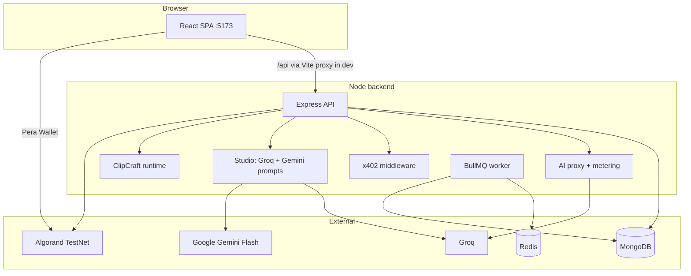

# SentinelAI

**Pay-per-use AI API marketplace on Algorand** — creators publish AI services, users pay in ALGO micro-transactions per call, and payments settle peer-to-peer on Algorand TestNet. The **Studio** adds subscription tiers for content workflows, prompt engineering, ClipCraft, and workflow automation.

**Production:** [sentinalai.dev](https://sentinalai.dev) (frontend) · API backend on Render (`sentinal-z3ue.onrender.com` recommended for `VITE_API_URL`).

---

## Team Sentinels

| Name            |
|-----------------|
| Aarya Pawar     |
| Manas Shete     |
| Debjit Debnath  |
| Aayush Lathi    |

---

## Table of Contents

1. [What this repository contains](#1-what-this-repository-contains)
2. [Business Model](#2-business-model)
3. [Repository structure](#3-repository-structure)
4. [Architecture](#4-architecture)
5. [Prerequisites](#5-prerequisites)
6. [Setup guide](#6-setup-guide)
7. [Environment variables](#7-environment-variables)
8. [Smart contract](#8-smart-contract)
9. [API surface (summary)](#9-api-surface-summary)
10. [Frontend routes](#10-frontend-routes)
11. [x402 Payment Protocol](#11-x402-payment-protocol)
12. [Agent Context JSON](#12-agent-context-json)
13. [Production notes](#13-production-notes)
14. [Git workflow and commits](#14-git-workflow-and-commits)
15. [Further reading](#15-further-reading)

---

## 1. What this repository contains

| Area | Purpose |
|------|---------|
| **`frontend/`** | Vite + React 18 + Tailwind. **Marketplace** (`/dashboard/*`) for API discovery, keys, usage, billing. **Studio** (`/studio/*`) for blogging, workflows, ClipCraft, **Advanced Prompt Generator**, AI chat (x402), analytics. **Docs** (`/docs/*`) for x402 and How It Works. |
| **`backend/`** | Express API, MongoDB, JWT auth, Algorand helpers, AI proxy, **x402** routes, **Studio** (Groq blogs, Gemini prompts, ClipCraft pipeline, subscriptions), BullMQ publishing worker. |
| **`contract/`** | Puya / **algopy** smart contract (`SentinelContract`) + deploy script + `artifacts/`. |

**Ecosystem split (product):**

| Product | Description |
|---------|-------------|
| **Marketplace** | Browse, buy, and use creator AI APIs. Pay-per-use in ALGO (`/api/use`) or **x402** (`/api/x402/use/:serviceId`) for agents. |
| **Studio** | Groq blog generation (SSE), multi-platform publishing, **Gemini prompt tools** (server-side), Workflow Studio, ClipCraft, plan upgrades in ALGO. |
| **Docs** | In-app guides for x402 integration and platform overview. |

---

## 2. Business Model

Sentinel operates as a **decentralized AI API marketplace** with a **Studio** subscription layer.

### Creators (Supply side)

- Publish AI services (Groq, OpenAI, Anthropic, Together AI).
- Set **ALGO per 1K tokens** + **minimum charge per call**.
- Provider keys stored **AES-256-GCM encrypted**.
- Marketplace payments go **user wallet → creator wallet** (P2P on TestNet).

### Users (Demand side)

- Pay **per call** in ALGO; API keys (`sk-sentinel-*`) or **burner wallet** for fewer manual signs.
- **x402** clients can call services without API keys — payment in the `X-PAYMENT` header is authentication.

### Platform (Sentinel)

- Marketplace: P2P to creators; optional **proof-of-intelligence** log fee (0.001 ALGO).
- **Studio subscriptions** (ALGO/month to `RECEIVER_WALLET`): Creator **5**, Pro **15**, Enterprise **40** ALGO.
- Optional **SentinelContract** tracks aggregate volume on-chain.

### Studio subscription limits (monthly)

| Tier | Blogs | Prompt Generator | Projects |
|------|-------|------------------|----------|
| **Free** | 3 | 10 | 2 |
| **Creator** | 50 | 200 | 10 |
| **Pro** | Unlimited | Unlimited | Unlimited |
| **Enterprise** | Unlimited | Unlimited | Unlimited |

Upgrades: `POST /api/studio/subscription/upgrade` (on-chain tx verified). Quotas reset on upgrade (30-day cycle).

### Key revenue streams

| Stream | Mechanism |
|--------|-----------|
| Studio subscriptions | ALGO/month for blogs, prompts, workflows, ClipCraft |
| Creator listings | Creators supply their own provider keys (zero-custody) |
| Proof-of-intelligence | Small on-chain fee per attested AI call |
| x402 marketplace | Programmatic agents pay minimum charge per call |

---

## 3. Repository structure

```
pay-per-usage-ai-api-access-system-using-algorand/
├── README.md
├── DOCUMENTATION.md          ← Deep-dive: flows, full endpoint tables
├── backend/
│   ├── package.json
│   └── src/
│       ├── server.js
│       ├── config/             ← db, firebase, corsOrigins, contract
│       ├── constants/        ← studioPlans.js, studioLimits.js
│       ├── middleware/       ← auth, studioQuota (blog + prompt)
│       ├── models/
│       ├── routes/             ← auth, services, use, x402.js, studio.routes.js, …
│       ├── controllers/        ← studio, studioPrompt, studioSubscription
│       ├── services/           ← aiProxy, geminiPromptService, blog.service, x402Middleware, …
│       ├── providers/          ← groqProvider.js
│       ├── studio/clipcraft/   ← ClipCraft pipeline (optional CLIPCRAFT_ENABLED)
│       ├── queues/ + workers/  ← BullMQ publishing
│       └── utils/
├── frontend/
│   ├── package.json
│   ├── vite.config.js          ← dev: proxies /api → VITE_PROXY_TARGET (default :5001)
│   └── src/
│       ├── App.jsx
│       ├── layouts/            ← MarketplaceLayout, StudioLayout, DocsLayout
│       ├── pages/              ← marketplace, studio/*, X402Docs, HowItWorks
│       ├── components/prompt-generator/
│       ├── api/                ← client.js, promptApi.js, workflowApi.js
│       └── wallet/             ← pera.js, burner.js
└── contract/
    ├── sentinel_contract.py
    ├── deploy.py
    └── artifacts/
```

---

## 4. Architecture



**Marketplace (classic):** `POST /api/use` → quote → on-chain pay → claim with `txId`.

**Marketplace (x402):** `POST /api/x402/use/:serviceId` → HTTP 402 → client pays → retry with `X-PAYMENT` → 200 + response.

**Studio blogs:** SSE from `/api/studio/blog/generate` (Groq). Publishing via BullMQ (`/api/studio/blog/schedule`).

**Prompt Generator:** `/api/studio/prompt/*` (Gemini on server; `GOOGLE_API_KEY`; quota middleware).

---

## 5. Prerequisites

| Tool | Notes |
|------|--------|
| **Node.js** | ≥ 20 |
| **MongoDB** | Atlas or local |
| **Redis** | Studio publishing queue (BullMQ) |
| **Google AI Studio key** | Prompt Generator (`GOOGLE_API_KEY` on backend) |
| **Groq API key** | Studio blogs (`GROQ_API_KEY`) |
| **Python 3.10+** | Optional: `contract/` deploy |
| **Algorand TestNet** | Pera Wallet + ALGO for demos and plan upgrades |

---

## 6. Setup guide

### 6.1 Clone and install

```bash
git clone https://github.com/lathi-aayush/pay-per-usage-ai-api-access-system-using-algorand.git
cd pay-per-usage-ai-api-access-system-using-algorand
```

**Backend** (default port **5000**; use **5001** if 5000 is busy — match Vite proxy)

```bash
cd backend
npm install
cp .env.example .env
# Set MONGO_URI, JWT_SECRET, ENCRYPTION_KEY, GROQ_API_KEY, GOOGLE_API_KEY, RECEIVER_WALLET, …
npm run dev
curl http://localhost:5000/api/health
```

**Frontend**

```bash
cd frontend
npm install
# Local dev: leave VITE_API_URL unset — Vite proxies /api to backend (see vite.config.js)
# If backend runs on 5001: add VITE_PROXY_TARGET=http://localhost:5001
npm run dev
# Open http://localhost:5173
```

**Do not** point `VITE_API_URL` at `sentinalai.dev` or `sentinalai.com` during local dev — those hosts serve the static site, not the API (causes CORS errors). Use the Vite proxy or `VITE_PROXY_TARGET=https://sentinal-z3ue.onrender.com` for remote API.

**Smart contract (optional)**

```bash
cd contract
python -m venv .venv
# Windows: .venv\Scripts\activate
pip install -r requirements.txt
python deploy.py
```

### 6.2 Verify

| Check | Expected |
|-------|----------|
| `http://localhost:5173` | SPA loads, login works |
| `GET /api/health` | `{"ok":true}` |
| `GET /api/services/agent-context` | JSON catalog |
| Studio → **Advanced Prompt Generator** | Generates after `GOOGLE_API_KEY` is set |
| Studio → **Plan & upgrade** | Shows blog + prompt quotas |

---

## 7. Environment variables

### 7.1 Core backend (`backend/.env`)

| Variable | Purpose |
|----------|---------|
| `PORT` | API port (default `5000`) |
| `MONGO_URI` / `MONGODB_URI` | MongoDB |
| `JWT_SECRET` | Session JWTs |
| `ENCRYPTION_KEY` | AES-GCM (32 chars) — burner wallet, provider keys |
| `NODE_ENV` | `production` serves `frontend/dist` |
| `FRONTEND_ORIGIN` / `CORS_ALLOWED_ORIGINS` | CORS (includes `localhost:5173`, `sentinalai.dev`) |
| `RECEIVER_WALLET` | Studio subscription payments (TestNet address) |

### 7.2 Algorand

| Variable | Purpose |
|----------|---------|
| `ALGOD_SERVER` / `ALGORAND_NODE` | Algod URL |
| `ALGO_INDEXER_URL` | Indexer for tx verify |
| `ALGO_APP_ID` / `ALGO_CONTRACT_ADDRESS` | Optional contract |
| `PLATFORM_MNEMONIC` / `PROOF_LOG_ADDRESS` | Proof-of-intelligence |

### 7.3 Studio AI

| Variable | Purpose |
|----------|---------|
| `GROQ_API_KEY` | Blogging Agent (Groq SSE) |
| `GOOGLE_API_KEY` | **Advanced Prompt Generator** (Gemini Flash on server) |
| `GEMINI_MODEL` | Optional override (`gemini-2.5-flash`, etc.) |
| `REDIS_URL` | Publishing queue |

### 7.4 ClipCraft (optional)

| Variable | Purpose |
|----------|---------|
| `CLIPCRAFT_ENABLED` | `true` to start ClipCraft runtime |
| See `backend/.env.example` | Provider mode, credits, queue adapters |

### 7.5 Frontend (`frontend/.env`)

| Variable | Purpose |
|----------|---------|
| `VITE_API_URL` | **Production build only** — Render backend URL (e.g. `https://sentinal-z3ue.onrender.com`) |
| `VITE_PROXY_TARGET` | **Local dev** — backend URL for Vite proxy (default `http://localhost:5001`) |
| `VITE_RECEIVER_WALLET` | Must match backend `RECEIVER_WALLET` for plan upgrades |
| `VITE_FIREBASE_*` | Firebase web client |
| `VITE_PUBLIC_SITE_URL` | Optional — blog links (`https://sentinalai.dev`) |

**Never commit** `.env` files, mnemonics, or API keys.

---

## 8. Smart contract

**Language:** Python **algopy** → TEAL via **puyapy**. **ARC-4** `SentinelContract`.

| Method | Description |
|--------|-------------|
| `create_application(min_amount)` | Deploy; set minimum payment |
| `purchase(pay)` | Payment txn ≥ min; increment stats |
| `read_stats()` | Read global counters |

**Backend:** `GET /api/contract/stats` when contract env is configured.

---

## 9. API surface (summary)

| Prefix | Role |
|--------|------|
| `/api/auth` | Login, Firebase |
| `/api/services` | Marketplace CRUD; `/agent-context` |
| `/api/use` | Classic pay-per-use (quote → pay → claim) |
| `/api/x402` | x402-gated AI (`/services`, `/use/:serviceId`) |
| `/api/payment`, `/api/access`, `/api/creator`, `/api/user` | Billing, keys, creator dashboard |
| `/api/profile` | Profile, **burner wallet** sync |
| `/api/contract`, `/api/wallet`, `/api/prediction` | Chain stats, wallet, forecasts |
| `/api/studio` | Blogs, projects, platforms, analytics, calendar, **subscription**, **workflows**, **clipcraft** |
| `/api/studio/prompt` | **generate**, **enhance**, **improve**, **analyze**, **variations** (auth + quota) |

Studio usage: `GET /api/studio/usage` → `tier`, `monthlyBlogsUsed`, `monthlyBlogLimit`, `monthlyPromptsUsed`, `monthlyPromptLimit`.

Details: **`DOCUMENTATION.md`**.

---

## 10. Frontend routes

### Marketplace (`/dashboard/*`)

Home (Agent Context JSON), browse, keys, usage, creators, service detail, billing transactions.

### Studio (`/studio/*`)

| Path | Feature |
|------|---------|
| `/studio` | Studio home |
| `/studio/workflows` | Workflow Studio (builder, templates, history) |
| `/studio/blogging-agent` | Groq blog editor + publish |
| `/studio/prompt-generator` | Advanced Prompt Generator (Gemini, subscription quota) |
| `/studio/clipcraft` | ClipCraft video clips pipeline |
| `/studio/chat` | AI Chat (x402-backed services) |
| `/studio/projects`, `/studio/calendar`, `/studio/drafts`, `/studio/published` | Content organization |
| `/studio/platforms` | Connected publish targets |
| `/studio/analytics` | Studio analytics |
| `/studio/plan` | Subscription upgrade (ALGO via Pera) |
| `/studio/queue`, `/studio/exports`, `/studio/storage`, `/studio/apps` | Ops / tooling |

### Docs (`/docs/*`)

| Path | Content |
|------|---------|
| `/docs/x402` | x402 user guide |
| `/docs/x402-api` | x402 developer reference |
| `/docs/how-it-works` | Platform overview |

### Other

| Path | Audience |
|------|----------|
| `/creator`, `/creator/new` | API creators |
| `/` | Landing + auth |

Legacy `/marketplace/*` and `/user/*` redirect to `/dashboard/*`.

---

## 11. x402 Payment Protocol

**Status: implemented** at `/api/x402` (packages `@x402/core`, `@x402/avm`).

| Endpoint | Description |
|----------|-------------|
| `GET /api/x402/services` | List x402-enabled services |
| `POST /api/x402/use/:serviceId` | Pay-per-call with HTTP 402 challenge / `X-PAYMENT` retry |

**Flow:** Client requests without payment → **402** + `Payment-Required` header → client signs Algorand tx → retry with `X-PAYMENT` → AI response. **No API key required** — sender address from the tx is the identity.

**Studio AI Chat** (`/studio/chat`) uses the same x402 service list for in-browser paid chat.

**Classic `/api/use`** remains for per-token metering and marketplace users with API keys.

In-app docs: `/docs/x402` and `/docs/x402-api`. Test page: `frontend/x402-test.html`.

---

## 12. Agent Context JSON

**`GET /api/services/agent-context`** — public, live catalog for AI assistants.

Includes per-service pricing, models, `how_to_use`, and `generated_at`. Copy from **Dashboard → Agent Context JSON** panel.

---

## 13. Production notes

### Deploy layout

| Service | Typical host | Env |
|---------|--------------|-----|
| **Frontend** | `sentinalai.dev` (Render/Vercel static) | `VITE_API_URL` = **backend** URL (not the `.dev` site URL) |
| **Backend** | `sentinal-z3ue.onrender.com` | `GOOGLE_API_KEY`, `GROQ_API_KEY`, `MONGO_URI`, `RECEIVER_WALLET`, `FRONTEND_ORIGIN=https://sentinalai.dev` |

### Checklist

- `npm run build` in `frontend/`; `NODE_ENV=production` on backend.
- Set **`GOOGLE_API_KEY`** on backend for Prompt Generator.
- Redis (TLS) for Studio publishing.
- Strong `JWT_SECRET` and `ENCRYPTION_KEY`.
- CORS: `sentinalai.dev`, Render URLs, and `http://localhost:5173` are in `backend/src/config/corsOrigins.js` defaults.
- Match `VITE_RECEIVER_WALLET` (frontend build) with `RECEIVER_WALLET` (backend).

### Local vs production API

| Environment | API access |
|-------------|------------|
| `npm run dev` | Same-origin `/api` → Vite proxy → local or `VITE_PROXY_TARGET` |
| Production SPA | Absolute `VITE_API_URL` → Render backend |

---

## 14. Git workflow and commits

**Branches:** `main` (release), `feature/*`, `fix/*`, team branches (`deb`, `aayush`, etc.).

**Commits:** Conventional Commits (`feat:`, `fix:`, `docs:`). No secrets in git.

**Pull requests:** Describe what/why, test steps; keep Marketplace vs Studio changes reviewable.

---

## 15. Further reading

- **`DOCUMENTATION.md`** — Full API tables, sequences, security.
- **`backend/.env.example`** — All backend flags including ClipCraft and Gemini.
- **`frontend/.env.example`** — Dev proxy vs production `VITE_API_URL`.
- **[x402.org](https://x402.org)** — x402 specification.
- **[Google AI Studio](https://aistudio.google.com/apikey)** — Gemini API key for Prompt Generator.
- **[Algorand TestNet Dispenser](https://bank.testnet.algorand.network/)** — TestNet ALGO.
